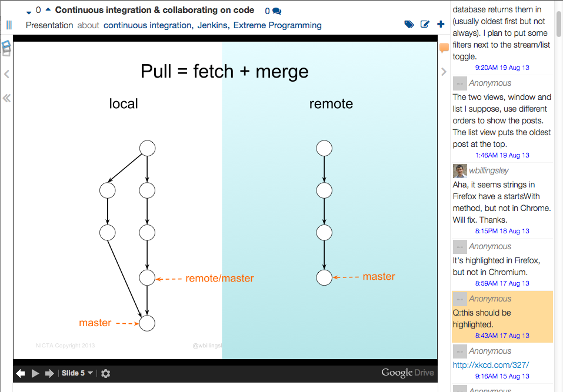
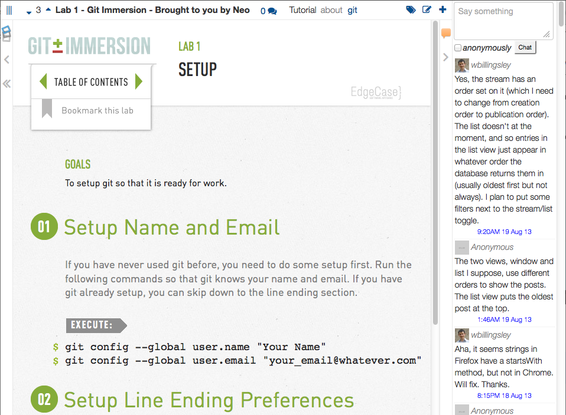

## Making social interactive teaching simple &mdash; online and in-class

Teaching is not a one-way activity &mdash; learning is a social and interactive experience.  And no matter how good your lectures or videos are, they are not the only content your students can learn from.

Impressory helps you and your class interact around content.  

This includes content that you write; it includes content you add from elsewhere on the web; and (if you wish) it includes content that your class discovers.

Interactions are live and social. Content is related to each other using a simple but powerful tagging system. And analytics helps you discover what your students did and did not find useful. 

Impressory is designed to be scalable. Whether you want to interact with your students in the lecture theatre, or run an online MOOC, Impressory can help.

Courses can be cloud-hosted, at <a href="http://impressory.com">impressory.com</a>, or you can run your own instance on your own server. It's also very easy to set up (free) at Heroku.

It's simple, small, free, and open source. I'm hoping it'll do for education what WordPress did for blog publishing.

### Screenshot gallery

  <!-- Indicators -->
  <ol class="carousel-indicators">
    <li data-target="#carousel-example-generic" data-slide-to="0" class="active"></li>
    <li data-target="#carousel-example-generic" data-slide-to="1"></li>
    <li data-target="#carousel-example-generic" data-slide-to="2"></li>
    <li data-target="#carousel-example-generic" data-slide-to="3"></li>
    <li data-target="#carousel-example-generic" data-slide-to="4"></li>
  </ol>

  <!-- Wrapper for slides -->
  

    

      

        
      

      
Posts on the newsfeed of Design Computing Stuido 2

    

    

      

        
      

      
A Google Slides presentation in the lecture

    

    

      

        
      

      
An external tutorial in the lecture

    

    

      

        
      

      
Clicking a topic tag helps you find other content

    

    

      

        
      

      
A Q&amp;A forum question

    

  

  <!-- Controls -->
  <a class="left carousel-control" href="#carousel-example-generic" data-slide="prev">
    
  </a>
  <a class="right carousel-control" href="#carousel-example-generic" data-slide="next">
    
  </a>

### Now <small>(orange means there's more on this to come)</small>

  

    

      
    
        

          <i class="icon-group"> </i>
          Social-style stream
        

      

      
    
        

          <i class="icon-tags"> </i>
          Topic-aware
        

      

      
    
        

          <i class="icon-signal"> </i>
          Learning analytics data
        

      

      
  	
        

          <i class="icon-comment"> </i>
          Live interaction
        

      

      
  	
        

          <i class="icon-bar-chart"> </i>
          Live polls without clickers
        

      

      
    
        

          <i>Q&amp;A</i>
          Q&amp;A forum with voting
        

      

      
    
        

          <i>LTI</i>
          Log in from your CMS
        

      
  

      
    
        

          <i class="icon-twitter"> </i>
          Use your Twitter account
        

      
  

      
    
        

          <i class="icon-github"> </i>
          Use your GitHub account
        

      
  

      
  	
        

          <i class="icon-youtube-play"> </i>
          YouTube
        

      

      
    
        

          <i class="icon-edit"> </i>
          Write content in Markdown
        

      

      
    
        

          <i class="icon-google-plus"> </i>
          Google Slides
        

      

      
    
        

          <i class="icon-globe"> </i>
          Embed the web
        

      

    

  

### Coming soon

  

    

      
    
        

          <i>T</i>
          Free text polls &amp; analytics
        

      

      
    
        

          <i class="icon-twitter"> </i>
          Twitter integration
        

      
  

      
    
        

          <i class="icon-facebook"> </i>
          Facebook integration
        

      
  

      
    
        

          <i class="icon-desktop"> </i>
          Reveal.js presentations
        

      
  

      
    
        

          <i class="icon-desktop"> </i>
          Prezi
        

      
  

    

  

