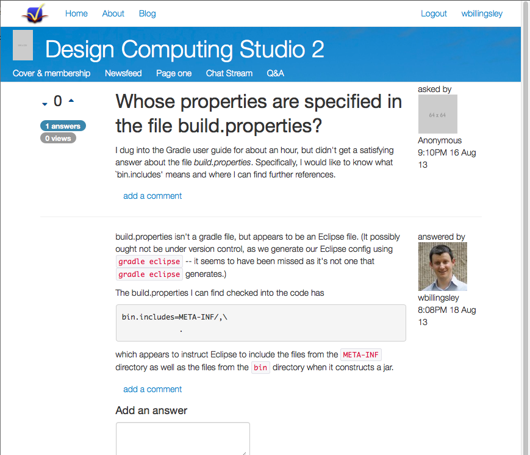

## Q&amp;A

Impressory includes a Q&amp;A forum, with voting on questions, answers and comments.  (Just the sort of thing you'd expect in a MOOC these days.)

Questions and answers are written in Markdown format.

  <!-- Indicators -->
  <ol class="carousel-indicators">
    <li data-target="#carousel-example-generic" data-slide-to="0" class="active"></li>
  </ol>

  <!-- Wrapper for slides -->
  

    

      

        
      

      
A Q&amp;A question

    

  

  <!-- Controls -->
  <a class="left carousel-control" href="#carousel-example-generic" data-slide="prev">
    
  </a>
  <a class="right carousel-control" href="#carousel-example-generic" data-slide="next">
    
  </a>

