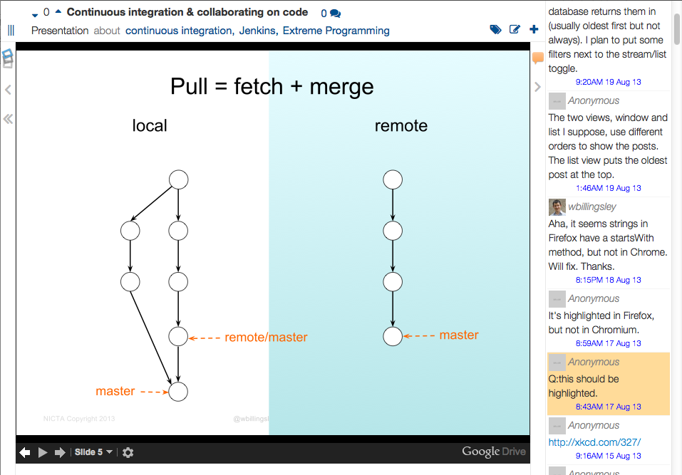

## Content viewer

Let's banish the days where teachers had to jump back and forth from Powerpoint to anything else they want to show, with their laptop and the projector doing the resolution dance each time.

The content viewer is typically how you show content in a lecture theatre, and how students watch a live lecture online.

  <!-- Indicators -->
  <ol class="carousel-indicators">
    <li data-target="#carousel-example-generic" data-slide-to="0" class="active"></li>
    <li data-target="#carousel-example-generic" data-slide-to="1"></li>
  </ol>

  <!-- Wrapper for slides -->
  

    

      

        
      

      
A Google Slides presentation in the lecture

    

    

      

        
      

      
An external tutorial in the lecture

    

  

  <!-- Controls -->
  <a class="left carousel-control" href="#carousel-example-generic" data-slide="prev">
    
  </a>
  <a class="right carousel-control" href="#carousel-example-generic" data-slide="next">
    
  </a>

### Live interaction on the main screen

In the lecture theatre, you can open the chat stream on the right hand side, so that students can comment and ask questions during the lecture. In Software Studio, we would often get twenty to thirty comments and questions per lecture &mdash; far more than the number of students who would be willing to stick their hand up and ask.  But that depends on your class size, room shape, and the ambience of the lecture.  

### Content sequencing and topic-	

And of course you can push polls to the chat stream, sequence different pieces of content after each other for the lecture, comment, vote, and easily navigate using the topic tags.

### Scalable virtual classrooms

For large remote classes, such as a MOOC, we also think this is a better way of interacting than virtual classrooms.  Add the broadcast (for instance using the YouTube URL of a Google Hangout-On-Air) as a content item, and use the polls and chat to allow your class to interact with you.  It's easier for students to skim-read text comments coming up from a large class than to wait while each other speaks, or try to skim video snippets.